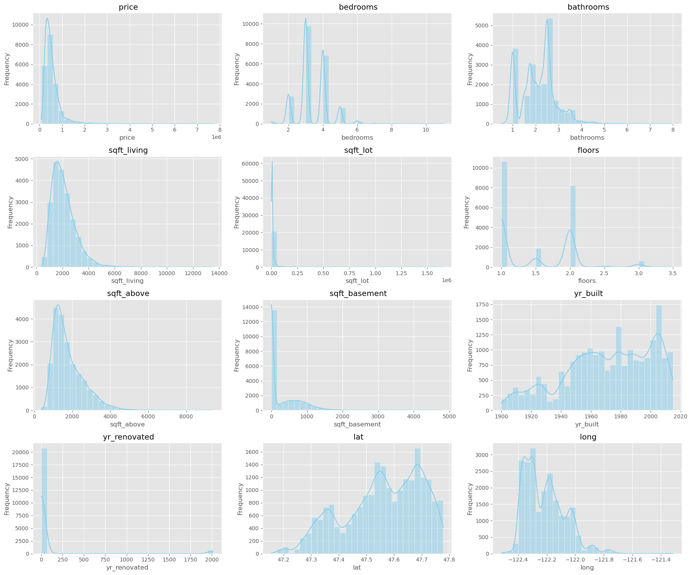
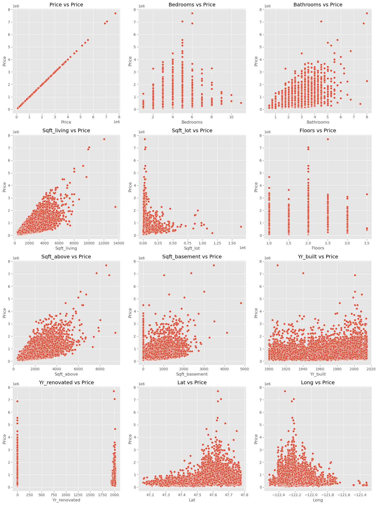
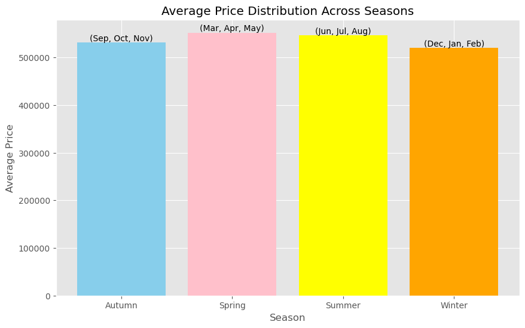

#  Exploring the Dynamics of Real Estate Market in King County: A Data Science Perspective
Business Overview
The `US` real estate market has seen fluctuations over time, generally trending upwards with occasional declines. This trend is driven by various factors, including supply and demand dynamics, economic conditions, interest rates, demographics, and location-specific elements

**Supply and demand** play a pivotal role in shaping house prices. Limited housing inventory compared to demand tends to drive prices higher, while an oversupply can lead to price decreases

**Economic factors**, such as employment levels, GDP growth, and inflation, influence both supply and demand. Favorable economic conditions stimulate demand, pushing prices up, while economic downturns can dampen demand, leading to stabilization or decline in prices.

**Interest rates** impact affordability, with lower rates boosting demand and prices, while higher rates may reduce demand and stabilize or lower prices.

**Demographic shifts**, like changes in household formation and migration patterns, affect housing preferences and demand. Location-specific factors, including proximity to employment, quality of schools, and neighborhood amenities, also influence prices.

Understanding these factors is crucial for navigating the real estate market effectively, whether buying, selling, investing, or developing properties.
# 1 PROJECT ALIGNMENT

### 1.1. Project Scope

Our project aims to equip Nara Real Estate(stakeholder) with the necessary insights and strategies to facilitate a successful entry into the King County real estate market. By leveraging data-driven analysis and market intelligence, we will provide actionable recommendations to navigate the complexities of the local market landscape effectively.

### 1.2. Problem Statement:

Despite its potential for growth and profitability, entering the King County real estate market presents Nara Real Estate with significant challenges stemming from the market's dynamic nature and diverse factors influencing supply, demand, and pricing. To ensure a successful market penetration strategy, Nara Real Estate requires a comprehensive understanding of local market dynamics, including the impact of economic conditions, demographic shifts, and location-specific elements on housing preferences and demand. Additionally, the company needs actionable insights and strategies derived from data-driven analysis to effectively identify lucrative market segments, optimize pricing strategies, and enhance client acquisition and retention efforts. Therefore, the overarching problem statement is to equip Nara Real Estate with the necessary tools, insights, and strategies to navigate the complexities of the King County real estate market and establish a strong presence while capturing market share effectively.

### 1.3. Objectives

Through our data analytics and market insights, we offer Nara Real Estate a strategic advantage by answering the following questions:

**1. House features affecting the prices of houses in King County**

Understanding home buyers' preferences can focus our campaign and help us guide clients in purchase of their new homes.

**2. Seasonal impact on house sale prices**

Understanding seasonal trends will influence when the campaign should be launched.

**3. Predicting Market trends and property value**

Using the dataset provided to create a model that predicts the market trend of the area and the property values.

**4. Locations which have the highest average house prices**

Understanding what locations to focus the advertising campaign on is key for our stakeholders.

We have been provided with a dataset with house sale prices in King County, Washington State, USA from May 2014 to May 2015 to use for this project.

### 1.4. Brief Conclusion

Through our comprehensive analysis and strategic recommendations, we aim to empower Nara Real Estate to make informed decisions and successfully enter the King County real estate market. Our data-driven approach will help them achieve sustainable growth and enance their penetration of King county real estate market..
# 2 DATA UNDERSTANDING
### Dataset Description

The data utilized for this project consists the following dataset:

`data/kc_house_data.csv`: This dataset contains detailed information about individual properties in King County, including attributes such as square footage, number of bedrooms and bathrooms, location, and sale price.

### Relevance of king County dataset from stakeholder

The columns in the dataset provide crucial information about various aspects of the houses that could potentially influence their sale prices. Features such as number of bedrooms, bathrooms, square footage, condition, and grade are likely to have a significant impact on home values. We'll use these features to build regression models and identify which characteristics contribute most to home prices.
# 3 DATA PREPARATION

The approach taken shall involve the following steps:

1. Data Mining
2. Data Cleaning

## 3.1 DATA MINING
We shall import the necessary libraries for the whole data analysis approach we shall be taking as well as reading into the various documents that we shall be using. We shall display the first 5 results of each to get a better understanding of what is in each documents and give a summary of what we are observing

**Relevance of king County dataset from stakeholder**

The columns in the dataset provide crucial information about various aspects of the houses that could potentially influence their sale prices. Features such as number of bedrooms, bathrooms, square footage, condition, and grade are likely to have a significant impact on home values. We'll use these features to build regression models and identify which renovations or characteristics contribute most to home prices.

Cursory Observation:
1. The dataframe has 21,597 entries with waterfront, view and yr_renovated having null entries
2. Datatypes range from int64, float64 and objects and will require further analysis
3. 21 columns in the dataset, further analysis to determine if all shall be used 

### 3.2. DATA CLEANING
Data cleaning shall involve the following steps:
1. Check and resolve for duplicate values
2. Check and resolve for null values
3. Check and resolve for extraneous values
4. Perform further cleaning as needed

## 4 EXPLORATORY DATA ANALYSIS

### 4.1. Univariate EDA

We'll explore the distribution of individual variables.
Observations: 

* Sale prices (price) in the dataset range nearly 3 orders of magnitude, from a low of about 78,000 to a staggering high of 7,700,000.

* Sale prices exhibit a positive skew, meaning that they display a right-skewed distribution where the mean is to the right of the median.

* A home has sold 11 times (the maximum value of bedrooms) within the time span covered by the data, though the most common number of sales is 1.

* The oldest home in the dataset is evidently more than 100 years old, with a recorded build date (yr_built) of 1900; the median build year is 1975.

* The improved tax value (sqft_living) and land tax value (sqft_lot) both range from 370 to more than 13,540.

* The largest property in the dataset covers over 1,651,359 sqft (sqft_lot), or more than 380 acres.

* The smallest home in the dataset is recorded as having 370 sqft (sqft_living), less than the smallest first floor which has 370 sqft (sqft_above)⁠—worth flagging.

* Considering the columns independently, homes in the dataset most commonly have 1 story (floors), 3 beds (bedrooms), and 2 baths (bathrooms).

* The sales data includes 116 unique dates (yr_built), suggesting the dataset has comprehensive coverage of the full 20+ year span.

* The dataset spans dozens of assessment areas (lat) and cities (long), as well as submarkets (lat) and subdivisions (long). Aside from sale numbers and subdivisions, the data have no explicitly missing (NaN) values; some columns may use a missingness indicator value (e.g., 0).
## Histograms for numerical features

**Bedrooms and Bathrooms**:

Most houses have around 3 bedrooms and 2 bathrooms.
These features could be relevant for predicting house prices. More bedrooms and bathrooms might lead to higher prices.

**Square Footage Variables**:

Sqft_living (square footage of the home), sqft_above (square footage apart from the basement), and sqft_basement all show right-skewed distributions.
Smaller living spaces are more common, which could impact house prices. Larger square footage might correlate with higher prices.

**Floors**:

The histogram for floors indicates that single-story homes are most common.
The number of floors might influence house prices. Single-story homes could have different pricing dynamics than multi-story ones.

**Year Built and Year Renovated**:

Yr_built shows that many houses were built in recent decades.

Yr_renovated has a large spike at zero, indicating that many homes have not been renovated.
These features could impact house prices. Newer homes or recently renovated ones might command higher prices.

**Latitude and Longitude**:

The histograms for latitude and longitude could indicate clustering by location.
Geographical location might play a significant role in house prices. Certain neighborhoods or regions could have higher or lower prices.

### 4.2 Bivariate EDA

Exploring the interplay among variables.

Our bivariate EDA encompasses scrutinizing the connections between various features and the price.
**Relationship with the features**

Now, let’s delve deeper by employing scatter plots to visually assess the linear relationships between individual features and the target variable. This exploration will provide a more granular understanding of how each feature contributes to the predictive dynamics of the target variable.

**Relationship with  numerical features**

**Bedrooms vs Price**:

There’s an increase in price with the number of bedrooms, but it’s not linear.
Homes with around 5-6 bedrooms have higher variability in price

**Bathrooms vs Price**:

Similar to bedrooms, more bathrooms generally correlate with a higher price.
However, there’s significant spread in the data, indicating other factors at play.

**Sqft_living vs Price**:

A clear positive correlation; larger living spaces are associated with higher prices.

**Sqft_lot vs Price**:

The correlation is less clear. Lot size (sqft_lot) might not be as influential on price

**Floors vs Price**:

Houses with more floors tend to have a higher price, but the relationship isn’t strong or linear.

**Sqft_above vs Price**:

Similar to sqft_living, more above-ground space correlates with higher prices.
Include sqft_above in your model

**Sqft_basement vs Price**:

There’s some positive correlation, but it’s weaker than sqft_living or sqft_above.
Consider it as a secondary feature.

**Yr_built vs Price**:

Newer houses tend to cost more, but there’s considerable variation in prices of older homes.
Year built is relevant but not the sole determinant

**Yr_renovated vs Price**:

Recently renovated houses can command higher prices.
Many old houses haven’t been renovated yet still have high values due to other factors like location or size.

**Zipcode vs Price**:

Certain zip codes (areas) have considerably higher median house prices.
Location plays a crucial role in determining house price.

**Relationship with  Categorical features**

**Waterfront vs Price**:

Homes with waterfronts tend to be significantly more expensive than those without.
Having a waterfront view can be a key determinant in pricing.

**View vs Price**:

The quality of the view impacts the price. Homes with excellent views command higher prices.
Enhancing views could potentially increase a property’s value.

**Condition vs Price**:

The condition of the home moderately influences the price. 
Very good and excellent conditions yield slightly higher prices, but not as significantly as other features like waterfront or view.

**Grade vs Price**:

There’s a strong correlation between grade and price. 
Higher-graded homes (especially those rated as Mansion or Luxury) fetch higher prices.

**Seasons vs price**:

The peak season for home sales typically occurs during the spring and summer months

**Identifying the peak and off-peak seasons for house sales.**

**Peak Home Sales Season**

The peak season for home sales typically occurs during the spring and summer months.
Specifically, the busiest home selling months are March,April, May, June, July, and August.
Buyers are actively searching for properties, and there’s typically increased demand.

The slowest months for home selling activity are November, December, January, and February.
Demand tends to be lower during these months.

factors Influencing Seasonality:

**Weather** Warmer weather encourages more people to explore the housing market.

**School Year**: Families often want to move before the start of the school year, which aligns with the spring and summer months.

## 5 REGRESSION MODELLING
Before beginning the modelling step, it is important that we consider what our goals are and what metrics of evaluation we will use. 

As a starting point, we are looking to establish the following models, each meeting different criteria.

**Model A**

This model will be generalisable. We will aim where possible to ensure it can be used as a basis towards creating a model for another area, so avoid features specific to King County such as exact `zipcode`. Provided we achieve a decent $R^2$, we will try and avoid interactions and/or polynomial regression. We will also try and limit the number of features if possible.

**Model B**

This model will be the more accurate whilst avoiding unecessary complexity.

**Model C**

This model will be our more accurate than model B and most likely complex. 

**Model D**

This model will be our most accurate and most likely complex. We will aim for the highest adjusted $R^2$ value and lowest Root Mean Squared Error (RMSE) for model C.

For all models, we only wish to have statistically significant features (p-value below 0.05).

### 5.1 Simple linear regression-Model A
We will begin with a simple linear regression model, using the single feature of `sqft_living` which looked to be a good predictor based on satisfying the linearity assumption and being positively correlated with price.

### 5.2 Multiple Linear Regression - Model B

For our next model, we will add more features.
e note that all p-values are below our threshold of 0.05. Compare to single linear regression, our model's accuracy has improved considerably.The R-Squared is now 68%

Let us investigate if the residuals are normally distributed.

There appears to be some issues with the residuals not being normally distributed.

Let us check homoscedasticity.

Whilst not ideal, there is no strong evidence of heteroscedasticity. As such we might not need to consider a log transformation of the target variable.

The RMSE has reduced and the mean error is now around $207,000. Our standard deviation remains low.

### 5.3 Multiple linear regression-Model 3
This model uses the dfnehot dataframe that had been further encoded

### 5.4 Log Transformation - Model D
This step included the log transformed columns.

From the  table you can see how our model has improved by the R-squared Increasing while the RMSE reducing.

## 6 CONCLUSIONS AND FINDINGS
### 6.1 Summary of Findings and Recommendations
**OBJ 1. House features affecting the prices of houses in King County**
- **We recommend targetting the campaign towards houses with a higher bedroom count**.
However for a given house depending on its square-footage, note that adding an additional bedroom does not necessarily result in a a sale price increase.
* We can see that square foot living has the highest influence on the price of the house. 
* The variables that have a major influence on the price of the house are; square foot living, age of the house,good condition of the house,if the house is on a waterfront and has an excellent view.
* The variables that has the least influence on the price of the house are; grade,number of bedrooms,sqft lot,sqft basement and sqft lot.

**OBJ 2. Seasonal impact on house sale prices**

The peak season for home sales typically occurs during the spring and summer months.
Specifically, the busiest home selling months are March,April, May, June, July, and August.
Buyers are actively searching for properties, and there’s typically increased demand.

The slowest months for home selling activity are November, December, January, and February.
Demand tends to be lower during these months.

The following factors influence seasonality of prices:
* Weather - Warmer weather encourages more people to explore the housing market.
* School Year - Families often want to move before the start of the school year, which aligns with the spring and summer
    months.

**OBJ 3. Predicting Market trends and property value in King County**

A model was developed using linear regression and it provided insight that showed the following key features were statistically significant and had an impact on price i.e. sqft of living space, bedrooms, sqft of basement, year renovated, house age.  This in turn affects the market trends in the area

**OBJ 4. Locations which have the highest average house prices**

Waterfront living is key, with the median house price for a house with a waterfront view being almost double that of one that does not have this feature.The neighbourhoods with the highest average house prices are Medina, Clyde Hill, Yarrow Point, Bellevue and Mercer Island.

## 7 RECOMMENDATIONS

### Future Work
The following data would provide additional insights and improve our model's performance.

**Commuting time**
Time it takes from the house location to downtown Seattle could be a good indicator, with better connected properties potentially being valued higher.

**Median Income per zipcode**
Understanding income distribution amongst zipcodes would also be an indicator of which neighbourhoods are more affluent and should be the focus of the campaign.

**Longer time span**
Having data beyond the one year of May 2014-May 2015 would let us examine whether there are any trends in location. For instance some neighbourhoods may be experiencing a price increase due to recent infrastructure development. Which areas are up and coming?

**School rankings**
Proximity to a good school is often a key requirement for wealthy parents and likely to drive a house price up.

**House Architectural Shape**: Additionally investigate certain features, such as constructional/architectural values of the house, to see what trends we could discern from that. 

In addition, further work on our model would include the following:
- investigating Principal Component Analysis to tackle multicollinearity
- considering other algorithms beyong linear regression
- consider regression methods to deal with under/over fitting

Finally with input from our stakeholders we could develop a more tailored model, focusing on houses of a certain value or in a certain neighbourhood.

Appendix:
1. Trends on house flipping in the US

https://www.attomdata.com/news/market-trends/flipping/attom-year-end-2022-u-s-home-flipping-report/